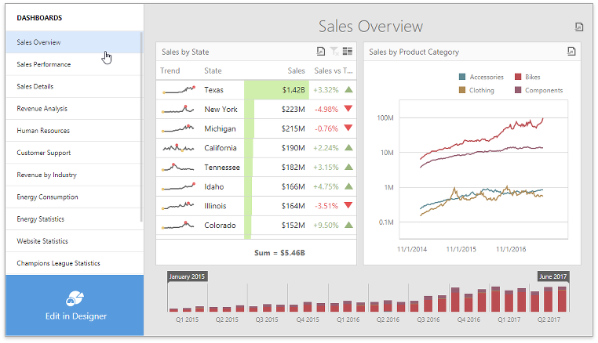

The **Dashboard Panel** is a Web Dashboard's extension that is a separate version of the integrated [Dashboard Panel](http://docs.devexpress.com/Dashboard/119771/) (see the [live demo](https://demos.devexpress.com/Dashboard/)). The Dashboard Panel displays a list of available dashboards and lets you switch between the designer and viewer modes. This extension provides you with more customization capabilities than the integrated Dashboard Panel.




- [Install a dashboard extension package](#install-a-dashboard-extension-package)
    - [Install scripts using npm](#install-scripts-using-npm)
    - [Download the latest version of scripts from GitHub](#download-the-latest-version-of-scripts-from-github)
- [Integrate dashboard extensions in the application](#integrate-dashboard-extensions-in-the-application)
    - [Modular approach](#modular-approach)
    - [Global namespaces approach](#global-namespaces-approach)
- [API](#api)
- [Development](#development)
- [License](#license)
- [See Also](#see-also)

## Install a dashboard extension package

You can install the required scripts **with npm** or download them **from the repository**:

### Install scripts using npm
Open a folder with the Web Dashboard application and run the following command:

```bash
npm install git+https://git@github.com/DevExpress/dashboard-extensions.git
```

Make sure that the [devexpress-dashboard](https://www.npmjs.com/package/devexpress-dashboard) package is installed.

### Download the latest version of scripts from GitHub
1. Download the latest version of scripts from [GitHub](https://github.com/DevExpress/dashboard-extensions/releases).
2. Copy the *dist* folder with scripts to your project with the Web Dashboard application.


## Integrate dashboard extensions in the application

You can now integrate the Dashboard Panel extension to the Web Dashboard. Use one of the [approaches](https://docs.devexpress.com/Dashboard/119108): **modular approach** or **global namespaces approach**. 

### Modular approach

1. Add the **dashboard-panel.html** file's content to the page containing the Web Dashboard inside the `<body>` section before the end tag:

    ```html
    <body>
        <!--...-->
        <!-- Place the dashboard-panel markup here. -->
    </body>
    ```

2. Add a link to the **dashboard-panel.css** stylesheet in the `<head>` section of the page containing the Web Dashboard:

    ```html
    <head>
        <!--...-->
        <link rel="stylesheet" href="../node_modules/dashboard-extensions/dist/dashboard-panel.css">;
    </head>
    ```

3. Import the required modules and register extensions in code before the control is rendered:

    ```javascript
        import { CustomDashboardPanelExtension } from 'dashboard-extensions/dist/dashboard-panel';
        // ...
        export class DashboardComponent implements AfterViewInit {
            ngAfterViewInit(): void {
                // ...
                dashboardControl.registerExtension(new CustomDashboardPanelExtension(dashboardControl));
                dashboardControl.render(); 
            }
        }

    ```

See [Client-Side Configuration (Modular Approach)](https://docs.devexpress.com/Dashboard/400409/) for more information on how to configure a client part of the Web Dashboard application for a modular approach.

### Global namespaces approach

1. Attach the downloaded scripts to the project inside the `<body>` section before the end tag onto the page containing Web Dashboard.

```html
<body>
    <!-- ... -->
    <script src="node_modules/dashboard-extensions/dist/dashboard-panel.js"></script>
</body>
```

2. Add the **dashboard-panel.html** file's content to the page containing the Web Dashboard inside the `<body>` section before the end tag.

3. Attach the **dashboard-panel.css** stylesheet file:

    ```html
    <head>
        <!-- ... -->
        <link href="node_modules/dashboard-extensions/dist/dashboard-panel.css" rel="stylesheet" />
    </head>
    ```

4. Register extensions in code before the control is rendered:

```javascript
    DevExpress.Dashboard.ResourceManager.embedBundledResources();
    var dashboardControl = new DevExpress.Dashboard.DashboardControl(document.getElementById("web-dashboard"), { 
        // ...
    });
    // ...
    dashboardControl.registerExtension(new CustomDashboardPanelExtension(dashboardControl));

    dashboardControl.render();
```

See [Client-Side Configuration (Global Namespaces)](https://docs.devexpress.com/Dashboard/119158/) for more information on how to configure a client part of the Web Dashboard application using the approach with global namespaces.

## API
The DashboardPanelExtension class contains the following public properties and methods that are similar to the integrated Dashboard Panel's API:

| Member | Description |
|--|--|
| [DashboardPanelExtension.allowSwitchToDesigner](https://docs.devexpress.com/Dashboard/js-DevExpress.Dashboard.DashboardPanelExtension#js_DevExpress_Dashboard_DashboardPanelExtension_allowSwitchToDesigner) | Specifies whether you can switch into the designer mode. This property control the visibility of the *Edit in Designer* button. Property value: bool.  |
| [DashboardPanelExtension.name](https://docs.devexpress.com/Dashboard/js-DevExpress.Dashboard.DashboardPanelExtension#js_DevExpress_Dashboard_DashboardPanelExtension_name) | Specifies a unique name of a Web Dashboard extension. The default value is 'dashboard-panel'. Property value: string. |
| [DashboardPanelExtension.panelWidth](https://docs.devexpress.com/Dashboard/js-DevExpress.Dashboard.DashboardPanelExtension#js_DevExpress_Dashboard_DashboardPanelExtension_panelWidth) | Specifies the width of the Dashboard Panel extension. The default value is 250 px. Property value: number. |
| [DashboardPanelExtension.visible](https://docs.devexpress.com/Dashboard/js-DevExpress.Dashboard.DashboardPanelExtension#js_DevExpress_Dashboard_DashboardPanelExtension_visible) | Specifies whether the Dashboard Panel is visible. Property value: bool. |
| [DashboardPanelExtension.updateDashboardsList](https://docs.devexpress.com/Dashboard/js-DevExpress.Dashboard.DashboardPanelExtension#js_devexpress_dashboard_dashboardpanelextension_updatedashboardslist) | Updates the dashboard list based on the dashboards available in the dashboard storage. |

## Development 

You can use this extension's code as a base for your own dashboard item [development](https://docs.devexpress.com/Dashboard/117546). See the **Development** section of [readme](../readme.md) to learn how to bundle the dashboard extension's files to create `dashboard-panel.js`, `dashboard-panel.css`, and `dashboard-panel.html`.

## License

This extension is distributed under the **MIT** license (free and open-source), but can only be used with a commercial DevExpress Dashboard software product. You can [review the license terms](https://www.devexpress.com/Support/EULAs/NetComponents.xml) or [download a free trial version](https://go.devexpress.com/DevExpressDownload_UniversalTrial.aspx) of the Dashboard suite at [DevExpress.com](https://www.devexpress.com).

## See Also

* [Create a Custom Item](https://docs.devexpress.com/Dashboard/117546)
