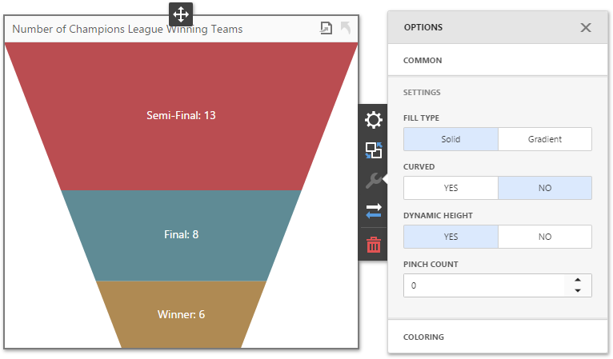

A custom **FunnelD3** item renders a funnel chart using the [D3Funnel](https://github.com/jakezatecky/d3-funnel/blob/master/README.md) JS library.

This dashboard item supports the following capabilities:

- [Master-Filtering](https://docs.devexpress.com/Dashboard/117060)
- [Drill-Down](https://docs.devexpress.com/Dashboard/117061)
- [Exporting](https://docs.devexpress.com/Dashboard/116694)
- [Appearance Customization](https://docs.devexpress.com/Dashboard/117152/)

> Note that the custom export functionality implemented in the Funnel D3 item is not supported for the Internet Explorer browser due to the problem with HTML canvas drawing. If you use IE 11 or earlier versions, the export buttons will be hidden. Refer to the following Microsoft issue to learn more: https://developer.microsoft.com/en-us/microsoft-edge/platform/issues/1015651/.


- [Install a dashboard extension package](#install-a-dashboard-extension-package)
    - [Install scripts using npm](#install-scripts-using-npm)
    - [Download the latest version of scripts from GitHub](#download-the-latest-version-of-scripts-from-github)
- [Integrate dashboard extensions in the application](#integrate-dashboard-extensions-in-the-application)
    - [Modular approach](#modular-approach)
    - [Global namespaces approach](#global-namespaces-approach)
- [Custom Settings](#custom-settings)
- [Development](#development)
- [License](#license)
- [See Also](#see-also)


## Install a dashboard extension package

You can install the required scripts **with npm** or download them **from the repository**:

### Install scripts using npm
Open a folder with the Web Dashboard application and run the following command:

```bash
npm install git+https://git@github.com/DevExpress/dashboard-extensions.git
```

Make sure that the [devexpress-dashboard](https://www.npmjs.com/package/devexpress-dashboard) package is installed.

### Download the latest version of scripts from GitHub
1. Download the latest version of scripts from [GitHub](https://github.com/DevExpress/dashboard-extensions/releases).
2. Copy the *dist* folder with scripts to your project with the Web Dashboard application.


## Integrate dashboard extensions in the application

You can now integrate the extensions to the Web Dashboard with one of the [approaches](https://docs.devexpress.com/Dashboard/119108): **modular approach** or **global namespaces approach**.


### Modular approach

Import the required modules and register extensions in code before the control is rendered: 

```javascript
    import { FunnelD3ItemExtension } from 'dashboard-extensions/dist/funnel-d3-item';
    // ...
    export class DashboardComponent implements AfterViewInit {
        ngAfterViewInit(): void {
            // ...
            dashboardControl.registerExtension(new FunnelD3ItemExtension(dashboardControl));
            dashboardControl.render(); 
        }
    }

```

See [Client-Side Configuration (Modular Approach)](https://docs.devexpress.com/Dashboard/400409/) for more information on how to configure a client part of the Web Dashboard application for a modular approach.

### Global namespaces approach

1. Attach the downloaded scripts to the project inside the `<body>` section before the end tag onto the page containing Web Dashboard.

```html
<body>
    <!-- ... -->
    <script src="node_modules/d3/dist/d3.min.js"></script>
    <script src="node_modules/d3-funnel/dist/d3-funnel.min.js"></script>
    <script src="node_modules/dashboard-extensions/dist/funnel-d3-item.js"></script>
</body>
```

2. Register extensions in code before the control is rendered:

```javascript
    DevExpress.Dashboard.ResourceManager.embedBundledResources();
    var dashboardControl = new DevExpress.Dashboard.DashboardControl(document.getElementById("web-dashboard"), { 
        // ...
    });
    // ...    
    dashboardControl.registerExtension(new FunnelD3ItemExtension(dashboardControl)); 

    dashboardControl.render();
```

See [Client-Side Configuration (Global Namespaces)](https://docs.devexpress.com/Dashboard/119158/) for more information on how to configure a client part of the Web Dashboard application using the approach with global namespaces.

## Custom Settings
The **FunnelD3** dashboard item provides the following settings that you can configure in the Web Dashboard UI:



* **Fill Type** - Specifies the funnel chart's *solid* or *gradient* fill type.
* **Curved** - Specifies whether the funnel is curved.
* **Dynamic Height** - Specifies whether the height of blocks are proportional to their weight.
* **Pinch Count** - Specifies how many blocks to pinch at the bottom to create a funnel "neck".

## Development 

You can use this extension's code as a base for your own dashboard item [development](https://docs.devexpress.com/Dashboard/117546). See the **Development** section of [readme](../readme.md#development) to learn how to bundle the dashboard extension's files to create `funnel-d3-item.js`.

## License

This extension is distributed under the **MIT** license (free and open-source), but can only be used with a commercial DevExpress Dashboard software product. You can [review the license terms](https://www.devexpress.com/Support/EULAs/NetComponents.xml) or [download a free trial version](https://go.devexpress.com/DevExpressDownload_UniversalTrial.aspx) of the Dashboard suite at [DevExpress.com](https://www.devexpress.com).

## See Also

* [Create a Custom Item](https://docs.devexpress.com/Dashboard/117546)