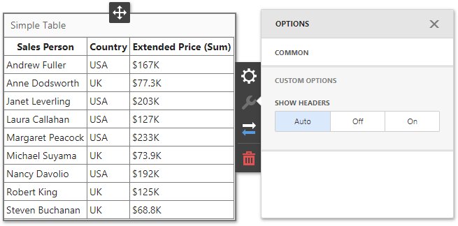

A custom **Simple Table** item renders data from the measure / dimensions as an HTML table. You can use the Simple Table as a detail item along with the Master-Filtering feature.

- [Install a dashboard extension package](#install-a-dashboard-extension-package)
    - [Install scripts using npm](#install-scripts-using-npm)
    - [Download the latest version of scripts from GitHub](#download-the-latest-version-of-scripts-from-github)
- [Integrate dashboard extensions in the application](#integrate-dashboard-extensions-in-the-application)
    - [Modular approach](#modular-approach)
    - [Global namespaces approach](#global-namespaces-approach)
- [Custom Settings](#custom-settings)
- [Development](#development)
- [License](#license)
- [See Also](#see-also)

## Install a dashboard extension package

You can install the required scripts **with npm** or download them **from the repository**:

### Install scripts using npm
Open a folder with the Web Dashboard application and run the following command:

```bash
npm install git+https://git@github.com/DevExpress/dashboard-extensions.git
```

Make sure that the [devexpress-dashboard](https://www.npmjs.com/package/devexpress-dashboard) package is installed.

### Download the latest version of scripts from GitHub
1. Download the latest version of scripts from [GitHub](https://github.com/DevExpress/dashboard-extensions/releases).
2. Copy the *dist* folder with scripts to your project with the Web Dashboard application.

## Integrate dashboard extensions in the application

You can now integrate the extension to the Web Dashboard. Use one of the [approaches](https://docs.devexpress.com/Dashboard/119108): **modular approach** or **global namespaces approach**.


### Modular approach

Import the required modules and register extensions in code before the control is rendered. The following code snippet shows the integration in the Angular application: 

```javascript
    import { SimpleTableItemExtension } from 'dashboard-extensions/dist/simple-table-item';
    // ...
    export class DashboardComponent implements AfterViewInit {
        ngAfterViewInit(): void {
            // ...
            dashboardControl.registerExtension(new SimpleTableItemExtension(dashboardControl));
            dashboardControl.render(); 
        }
    }

```

See [Client-Side Configuration (Modular Approach)](https://docs.devexpress.com/Dashboard/400409/) for more information on how to configure a client part of the Web Dashboard application for a modular approach.

### Global namespaces approach

1. Attach the downloaded scripts to the project inside the `<body>` section before the end tag onto the page containing Web Dashboard.

```html
<body>
    <!-- ... -->
    <script src="node_modules/dashboard-extensions/dist/simple-table-item.js"></script>
</body>
```

2. Register extensions in code before the control is rendered:

```javascript
    DevExpress.Dashboard.ResourceManager.embedBundledResources();
    var dashboardControl = new DevExpress.Dashboard.DashboardControl(document.getElementById("web-dashboard"), { 
        // ...
    });
    // ...
    dashboardControl.registerExtension(new SimpleTableItemExtension(dashboardControl));    

    dashboardControl.render();
```

See [Client-Side Configuration (Global Namespaces)](https://docs.devexpress.com/Dashboard/119158/) for more information on how to configure a client part of the Web Dashboard application using the approach with global namespaces.

## Custom Settings
The **Simple Table** dashboard item supports the following setting that you can configure in the Web Dashboard UI:



* **Show Headers** - Specifies whether to show the field headers in the table. The default value is *Auto*.

## Development 

You can use this extension's code as a base for your own dashboard item [development](https://docs.devexpress.com/Dashboard/117546). See the **Development** section of [readme](../readme.md) to learn how to bundle the dashboard extension's files to create `simple-table-item.js`.

## License

This extension is distributed under the **MIT** license (free and open-source), but can only be used with a commercial DevExpress Dashboard software product. You can [review the license terms](https://www.devexpress.com/Support/EULAs/NetComponents.xml) or [download a free trial version](https://go.devexpress.com/DevExpressDownload_UniversalTrial.aspx) of the Dashboard suite at [DevExpress.com](https://www.devexpress.com).

## See Also

* [Create a Custom Item](https://docs.devexpress.com/Dashboard/117546)